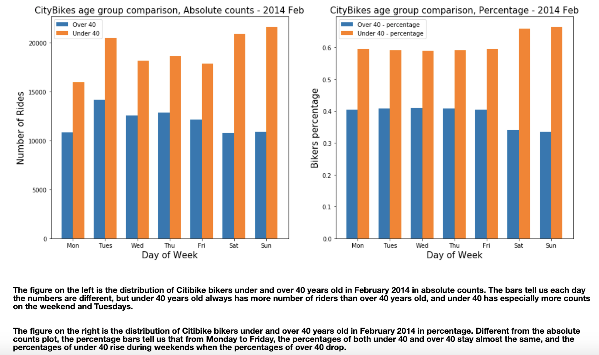

Based on the reviews given by cb4102 and ku373, I improved my plot from HW8 as follow:

I added a percentage plot in addition to the absolute counts to more clearly compare the relative ridership between the two age groups.
I also edited the titles and labels of the plots based on the feedback, and I described the plots in more details.
I didn't change the side-by-side bar to a stacked bar, however, because the stacked bar is confusing to me and I personally prefer the side-by-side bar since it can show the differences in a straightforward way.

For original plot, please refer to: https://github.com/xiaoninh/PUI2018_xh1163/blob/master/HW8_xh1163/readme.md
For code that generates the plots,please refer to:: https://github.com/xiaoninh/PUI2018_xh1163/blob/master/HW8_xh1163/HW8_plot_code.ipynb 

