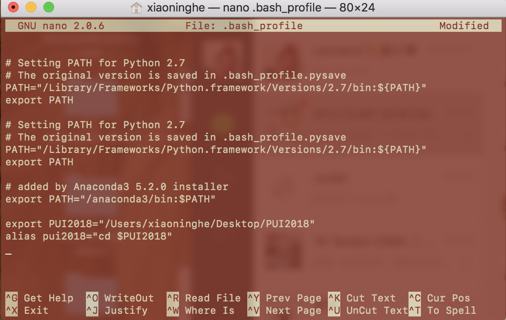

# PUI2018_xh1163

This folder contains Week 1's Homework for the PUI class. 

In Homework 1, I was responsible in creating an Environmental variable "PUI2018" that points to the PUI2018 directory I have created, and also setting up an alias "pui2018" as a shortcut of commend that takes me to that directory. 

While setting up the enviromental variable and alias, I also need to make sure that they are permanently saved in the bash_profile and can be used for later. 

The Screenshots folder include a screenshot of the bash_profile file where you can see the alias and enviromental variable I created, and a screenshot of my terminal which shows a series of commands and their output to show that the enviromental variable and alias are actually exist and work well. 

There is also an extra credit HW uploaded in the folder as "HW1_Extra credit_xh1163.ipynb", for more details please review the document.

