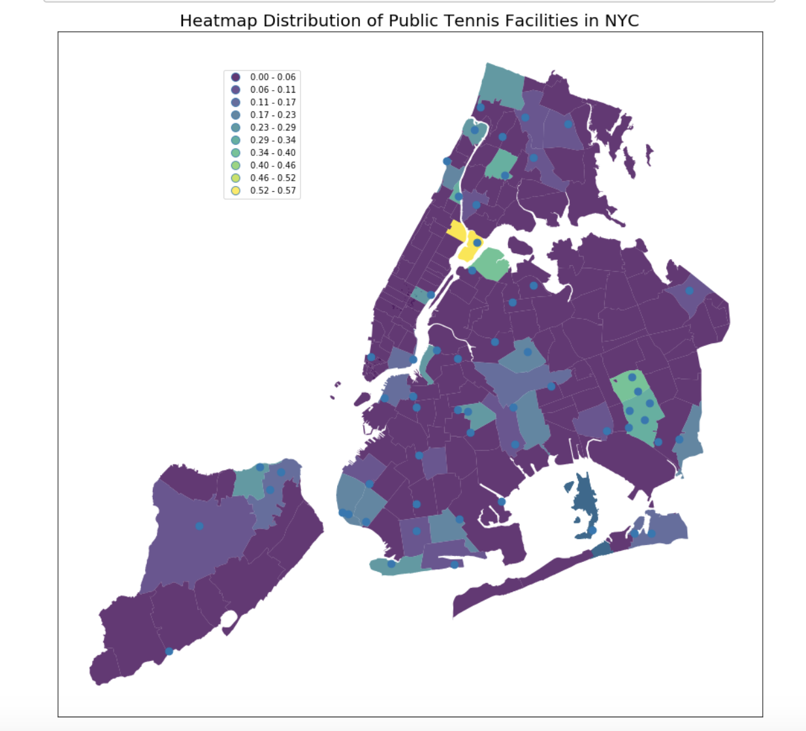
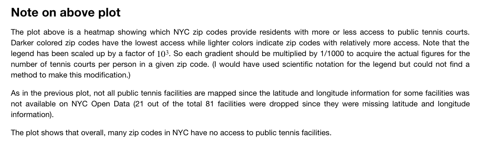

It would be best if the plot is embedded in the README.md as required. I took screen shots of the final plot and its caption from the assignment 1 notebook. 

  
Review:

You did a very good job on the plot caption explaining what the heatmap shows and what the darker color means. However, there are something that can be improved. First of all, the color of the blue dot is too close to the background color of the map, which makes the dots hard to observe on the map. Change the dots color to a brighter one such as orange or red will make the plot much more readable. Second, the legend of the map may also cause some confusion because they are representing in color dots, which will easily make the reader think that the legend is for the blue dots not for the map. Maybe consider changing the legend, or using another shape like stars to present the locations instead of dots.
