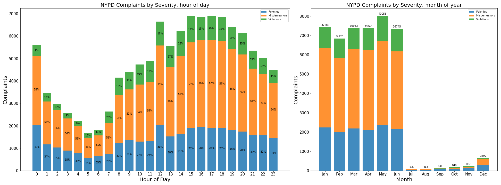

Fig. 1: Bar chart showing NYPD Complaints by law category, binned by hour of day and month of year

Review: 

In the plot on the left, the three distinct colors distinguish the categories of complaints very well. The labels at the corner and the percentages on each bar make the plot very descriptive. However, the bars are too close to each other and the texts on each bar make the plot seem too packed, which is distracting when first looking at it. The plot will be easier to read if there is more gap between each bar. Maybe consider increase the width of the figure, or reduce the hours in the x-axis (instead plotting every hour, plot every 2 hours, etc.,)

The plot on the right is less dense compare to the plot on the left probably because there are fewer months in a year compare to hours in a day, and there are fewer texts on the plot. It would be better if the caption explains why there is such a big difference between June and July.

 

Fig. 2: Plots of NYPD Complaints in all five boroughs by law category

Review: 
 
The three maps showing the NYPD Complaints in all five boroughs look very good. The plots are straightforward with each color representing one type of complaint, and the denser color indicating more complains in the areas.
